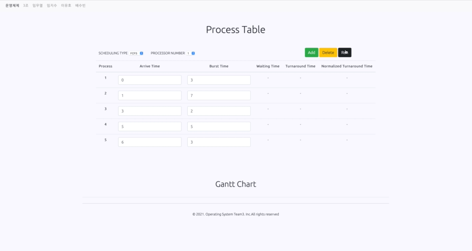

# 💻 Process_Scheduling 

## 👏 URL
**[Process_Scheduling](https://processscheduling.kro.kr)**

## 🛠 제작자
 - 17학번 임우열
 - 17학번 임지수
 - 17학번 이유호
 - 19학번 배수빈

## 🖥 Project Example

## 💡 구현 요소 - Process Scheduling

- FCFS(First Come First Service)
- RR(Round-Robin)
- SPN(Shortest Process Next)
- SRTN(Shortest Remaining Time Next)
- HRRN(High Response Ratio Next)
- DTRR(Dynamic TimeQuantum Round-Robin)

## 🧱 기술 스택

- AWS / EC2 / ubuntu : 배포 서버
- Django/python : Web FrameWork / BackEnd
- Nginx : Django App 8000포트 -> Web 80포트로 전환
- JavaScript / HTML5 / CSS : FrontEnd

## 📖  사용법

### 1. 깃 클론

- `git clone [url]`

### 2. 가상 환경 생성 및 실행 후, 종속성 다운로드

- `python -m venv [가상환경 명]`
- window : `source [가상환경 명]/Scripts/activate` / mac : `source [가상환경 명]/bin/activate`
- `pip install -r requirements.txt`

## ⚙️ 로컬 서버 실행
- `python manage.py collectstatic`
- `python manage.py makemigrations`
- `python manage.py migrate`
- `python manage.py runserver`
